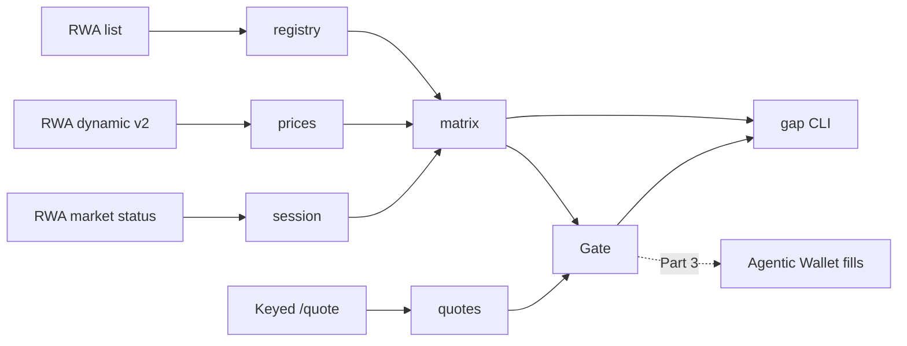

# Executable Gap Desk

**Displayed gaps lie. Executable ones don't.**

The same US stock trades on BNB Smart Chain as three different tokens: Ondo (`NVDAon`), xStocks (`NVDAx`) and bStocks (`NVDAB`). Their displayed prices can disagree by 10% or more, which looks like free money. Most of it isn't: the price is stale, the multiplier is wrong, or there is no liquidity to fill against.

Executable Gap Desk shows the displayed gap next to the executable one, gates every trade with a deterministic GO / CAUTION / BLOCK policy, and only then places small guarded fills through the Binance Agentic Wallet.

Built for **BNB Hack: Tokenized Stocks Edition** (BSC mainnet, spot only).

## Status

| Part | What | State |
|------|------|-------|
| 1 | Data truth: registry, session, per-share prices, displayed-gap matrix, CLI | done |
| 2 | Executable quotes and the GO / CAUTION / BLOCK gate | done |
| 3 | Guarded mainnet fills via `baw` with receipts | next |
| 4 | Web desk | planned |
| 5 | Agentic Wallet and BNB Agent Studio integrations | planned |
| 6 | Ship: polish, demo, DX report | planned |

## Quickstart

Requires Node 24+ and pnpm 9.

```bash
pnpm i
pnpm gap matrix --multi          # every ticker listed on 2+ platforms, with displayed gaps and flags
pnpm gap matrix --ticker MSTR GME --sort gap
pnpm gap session                 # US session, countdown to the next open/close
pnpm gap resolve NVDA            # every BSC venue for a ticker, symbol or address
pnpm test                        # offline tests against recorded fixtures
```

No key is needed for the commands above. The executable-quote commands use the keyed Trading API: copy `.env.example` to `.env.local` (gitignored), fill in `BW3_API_KEY`, `BW3_API_SECRET` and optionally `GAP_WALLET_ADDRESS`, then:

```bash
pnpm gap ping                    # checks signing against the keyed API
pnpm gap check NVDA              # Truth Card: displayed vs executable per venue, verdict, best venue
pnpm gap check NVDA --ladder     # adds $100 and $500 quotes to measure price impact
pnpm gap quote AAPLon --usd 25 100 500
pnpm gap snapshot --all          # $25 sweep of every BSC tokenized stock (~75 s, rate-limited)
```

Example (2026-09-29, US regular session):

```text
MSTR   Ondo     MSTRon   $155.44   $155.77 ondo    -0.21%   TRADING
       bStocks  MSTRB    $155.47   $155.77 ondo    -0.19%   TRADING   no session
       xStocks  MSTRx    $138.86   $155.77 ondo   -10.86%   TRADING   LARGE GAP no session
```

MSTRx looks 11% cheap. Its price has not moved all day, and a $25 aggregator quote for it (like AAPLx and NVDAx) returns `40374 RWA_INSUFFICIENT_LIQUIDITY`. That is the trap this desk exists to catch.

### The Truth Card

`gap check` quotes $25 of USDT into every venue for a ticker and runs each quote through the gate:

```text
MSTR  stock $155.55 (ondo)   US regular session   size $25, quotes 0s old
│ Venue   │ Platform │ Displayed │ Disp. gap │ Executable │ Exec. gap │ Mode / vendor        │ Verdict │
│ MSTRon  │ Ondo     │   $155.78 │    +0.14% │        n/a │       n/a │ no liquidity (40374) │  BLOCK  │
│ MSTRB * │ bStocks  │   $155.94 │    +0.25% │    $155.97 │    +0.27% │ SWAP / LiquidMesh    │  GO     │
│ MSTRx   │ xStocks  │   $138.86 │   -10.73% │        n/a │       n/a │ no liquidity (40374) │  BLOCK  │
 BLOCK  MSTRx
   1. Quote failed: no liquidity from any vendor (40374).
Best venue: MSTRB (GO, +0.27% vs the stock, $155.97/share)
```

The 11% "discount" can't be bought. The only venue that fills does so at +0.27%.

The opposite trap is worse, because the displayed price looks fine. AAOIB displays within 0.2% of the stock, but the aggregator routes $25 through a thin Uniswap V4 pool and fills at **+397%** (API price impact 0.96). The gate blocks it for three reasons: the gap is too wide, displayed and executable disagree, and the fill is far above the displayed price. `gap quote MSFTon --usd 25` shows the extreme case: about $1 billion per share.

### Full sweep

`gap snapshot --all` (2026-09-29 14:39 UTC, regular session, $25 per venue) covered 117 tickers and 271 venues in 73 s:

| Verdict | Venues | Main reasons |
|---------|--------|--------------|
| GO | 134 | fill within 0.75% of the stock |
| CAUTION | 4 | fill 0.75–1.5% off |
| BLOCK | 133 | 106 quote with no liquidity (all 86 xStocks, 12 bStocks, 8 Ondo); about 25 thin-pool routes at +100% to +800% |

113 of the 117 tickers have at least one safe venue. Every successful quote came back as `SWAP` via LiquidMesh; see [DX log #16](docs/DX_LOG.md#16-docs-say-ondo-always-routes-via-rfq-live-quotes-are-all-swap).

### Gate policy

The gate is a pure function of the venue data, the quote, the session and [`packages/core/policy/default.json`](packages/core/policy/default.json), which is validated with zod. The worst rule wins:

| Rule | Threshold | Verdict |
|------|-----------|---------|
| No quote, quote error, or quote older than 60 s | | BLOCK |
| Trade size over the cap | $25 | BLOCK |
| Market or asset paused / not open | | BLOCK |
| Executable gap vs the stock | ≤ 0.75% GO, ≤ 1.5% CAUTION, else | BLOCK |
| No stock price to compare against | venues within 3% CAUTION, else | BLOCK |
| Displayed vs executable gap differ | > 3% | BLOCK |
| Fill vs displayed price per share | > 2% | BLOCK |
| Price impact from $25 to $100 (with `--ladder`) | > 1% | CAUTION |
| Outside US regular hours | | at best CAUTION |

The best venue is the cheapest GO, falling back to the cheapest CAUTION. A BLOCK venue is never recommended.

## How it works



- **Registry** (`packages/core/src/registry.ts`): BSC venues from the public RWA list, platform by `type` (1 Ondo, 2 xStocks, 3 bStocks), grouped by ticker.
- **Session** (`session.ts`): market status normalized to premarket / regular / postmarket / overnight / closed / pause / weekend, with correctly ordered next open and close.
- **Prices** (`prices.ts`): `perShare = tokenPrice / sharesMultiplier`, using the live multiplier from dynamic v2. The reference is the underlying stock price (Ondo first, then xStocks), never a venue's own token price.
- **Matrix** (`matrix.ts`): displayed gap per venue with flags `LARGE_DISPLAYED_GAP` (3%+), `NO_PRICE`, `NO_REFERENCE`, `MULTIPLIER_MISMATCH`, `STATUS_MISSING` and `API_ERROR`. One failing venue never fails the matrix.
- **Signer** (`signer.ts`): HMAC-SHA256 request signing for the keyed Web3 API (`/build` prefix included in the signed path). A 429 or 5xx response is re-signed with a fresh timestamp before retrying.
- **Quotes** (`quotes.ts`): USDT to token quotes at $25, $100 and $500. `fillPerShare = usd / (tokensOut × multiplier)`, `executableGap = fillPerShare / stock − 1`. Error codes map to plain-English reasons. Requests are spaced at 4.5 per second to stay under the 5 RPS endpoint limit.
- **Gate** (`gate.ts`): deterministic GO / CAUTION / BLOCK per venue with numbered reasons, plus the best venue per ticker.
- **Snapshot** (`snapshot.ts`): the rate-limited sweep behind `gap snapshot`, cached for 60 s.

```text
packages/core/     data layer (config, http, schemas, registry, session, prices, matrix, signer, quotes, gate, snapshot) + tests
packages/core/policy/  gate policy (JSON, zod-validated)
apps/agent/        gap CLI
scripts/           fixture recorder
docs/DX_LOG.md     developer-experience findings
docs/vendor/       snapshot of the Binance Web3 llms-full.txt docs
```

## Proof ledger

_Mainnet transactions, quotes and gate decisions will be listed here from Part 3._

| Time (UTC) | Venue | Side | Size | Gate | Quote vs fill | Tx |
|------------|-------|------|------|------|---------------|----|
| | | | | | | |

## Developer experience

We keep a running log of every rough edge we hit in the Binance Web3 APIs, the Skills Hub and the Agentic Wallet CLI, each with a reproduction and a suggested fix: [`docs/DX_LOG.md`](docs/DX_LOG.md) (21 entries so far).

_The full DX report will be summarized here in Part 6._

## License

[MIT](LICENSE)
