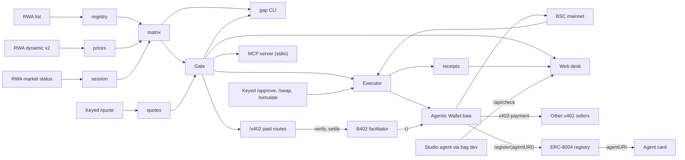

# Executable Gap Desk

[](https://github.com/Assassin859/executable-gap-desk/actions/workflows/ci.yml)

**Displayed gaps lie. Executable ones don't.**

The same US stock trades on BNB Smart Chain as three different tokens: Ondo (`NVDAon`), xStocks (`NVDAx`) and bStocks (`NVDAB`). Their displayed prices can disagree by 10% or more, which looks like free money. Most of it isn't: the price is stale, the multiplier is wrong, or there is no liquidity to fill against.

Executable Gap Desk shows the displayed gap next to the executable one, gates every trade with a deterministic GO / CAUTION / BLOCK policy, and only then places small guarded fills through the Binance Agentic Wallet.

Built for **BNB Hack: Tokenized Stocks Edition** (BSC mainnet, spot only).

**Live desk: [executable-gap-desk.vercel.app](https://executable-gap-desk.vercel.app)**. Open any stock for live gated quotes.

## Status

| Part | What | State |
|------|------|-------|
| 1 | Data truth: registry, session, per-share prices, displayed-gap matrix, CLI | done |
| 2 | Executable quotes and the GO / CAUTION / BLOCK gate | done |
| 3 | Guarded mainnet fills via `baw` with receipts | done |
| 4 | Web desk: radar, Truth Cards, proof ledger, DX log | done |
| 5 | Agentic Wallet and BNB Agent Studio integrations: CI (5.1), gated wallet trading (5.2), the x402 buyer (5.3), the B402 seller with ERC-8004 identity (5.4), the MCP server, Studio agent and first paid sale (5.5), and all of it on `/proof` (5.6) | done |
| 6 | Ship: polish, demo, DX report | planned |

## For judges

Each line is one integration and where to see it working. Every on-chain claim links to BscScan from [`/proof`](https://executable-gap-desk.vercel.app/proof).

- **The desk:** [the radar](https://executable-gap-desk.vercel.app) shows every BSC tokenized stock with displayed vs executable gap; [a Truth Card](https://executable-gap-desk.vercel.app/t/MSTR) quotes each venue live and shows why MSTRx's displayed discount is a BLOCK.
- **Proof ledger:** [`/proof`](https://executable-gap-desk.vercel.app/proof) lists the mainnet fills, wallet market orders, refusals, x402 purchases and the sale, and the ERC-8004 registration, each from a committed receipt.
- **Agentic Wallet, trading:** gated buys through `baw contract-call` and gated sells through `baw market-order`, every fill within 0.02% of its gated quote ([Guarded execution](#guarded-execution), [Wallet trading](#wallet-trading-agentic-wallet-market-and-limit-orders)).
- **Agentic Wallet, paying over x402:** paid CoinMarketCap data with `baw x402-payment`, behind per-call and daily caps ([Paying for data](#paying-for-data-over-x402-agentic-wallet)).
- **Selling over x402 (B402):** `curl -i https://executable-gap-desk.vercel.app/x402/gap/NVDA` answers 402 with U and USD1 requirements; one paid call settled through B402 into the Agentic Wallet ([Selling the gate](#selling-the-gate-over-x402-b402)).
- **Agent identity:** ERC-8004 agent `360456` on BSC mainnet, whose `agentURI` is the [agent card](https://executable-gap-desk.vercel.app/.well-known/agent-card.json) ([Agent identity](#agent-identity-erc-8004)).
- **MCP:** five read-only tools for Cursor or any MCP client, set up by [`.cursor/mcp.json`](.cursor/mcp.json) ([MCP server](#mcp-server-cursor)).
- **BNB Agent Studio:** a `bag init` project serving the gate over A2A, MCP and x402 with `bag dev` ([Studio agent](#bnb-agent-studio-agent)).
- **Developer experience:** 42 reproducible findings with suggested fixes, on the [DX page](https://executable-gap-desk.vercel.app/dx) and in [`docs/DX_LOG.md`](docs/DX_LOG.md).

## Quickstart

Requires Node 22.12+ (24 recommended) and pnpm 9.

```bash
pnpm i
pnpm gap matrix --multi          # every ticker listed on 2+ platforms, with displayed gaps and flags
pnpm gap matrix --ticker MSTR GME --sort gap
pnpm gap session                 # US session, countdown to the next open/close
pnpm gap resolve NVDA            # every BSC venue for a ticker, symbol or address
pnpm test                        # offline tests against recorded fixtures
```

No key is needed for the commands above. The executable-quote commands use the keyed Trading API: copy `.env.example` to `.env.local` (gitignored), fill in `BW3_API_KEY`, `BW3_API_SECRET` and optionally `GAP_WALLET_ADDRESS`, then:

```bash
pnpm gap ping                    # checks signing against the keyed API
pnpm gap check NVDA              # Truth Card: displayed vs executable per venue, verdict, best venue
pnpm gap check NVDA --ladder     # adds $100 and $500 quotes to measure price impact
pnpm gap quote AAPLon --usd 25 100 500
pnpm gap snapshot --all          # $25 sweep of every BSC tokenized stock (~3 min, rate-limited)
```

Example (2026-09-29, US regular session):

```text
MSTR   Ondo     MSTRon   $155.44   $155.77 ondo    -0.21%   TRADING
       bStocks  MSTRB    $155.47   $155.77 ondo    -0.19%   TRADING   no session
       xStocks  MSTRx    $138.86   $155.77 ondo   -10.86%   TRADING   LARGE GAP no session
```

MSTRx looks 11% cheap. Its price has not moved all day, and a $25 aggregator quote for it (like AAPLx and NVDAx) returns `40374 RWA_INSUFFICIENT_LIQUIDITY`. That is the trap this desk exists to catch.

### The Truth Card

`gap check` quotes $25 of USDT into every venue for a ticker and runs each quote through the gate:

```text
MSTR  stock $155.55 (ondo)   US regular session   size $25, quotes 0s old
│ Venue   │ Platform │ Displayed │ Disp. gap │ Executable │ Exec. gap │ Mode / vendor        │ Verdict │
│ MSTRon  │ Ondo     │   $155.78 │    +0.14% │        n/a │       n/a │ no liquidity (40374) │  BLOCK  │
│ MSTRB * │ bStocks  │   $155.94 │    +0.25% │    $155.97 │    +0.27% │ SWAP / LiquidMesh    │  GO     │
│ MSTRx   │ xStocks  │   $138.86 │   -10.73% │        n/a │       n/a │ no liquidity (40374) │  BLOCK  │
 BLOCK  MSTRx
   1. Quote failed: no liquidity from any vendor (40374).
Best venue: MSTRB (GO, +0.27% vs the stock, $155.97/share)
```

The 11% "discount" can't be bought. The only venue that fills does so at +0.27%.

The opposite trap is worse, because the displayed price looks fine. AAOIB displays within 0.2% of the stock, but the aggregator routes $25 through a thin Uniswap V4 pool and fills at **+397%** (API price impact 0.96). The gate blocks it for three reasons: the gap is too wide, displayed and executable disagree, and the fill is far above the displayed price. `gap quote MSFTon --usd 25` shows the extreme case: about $1 billion per share.

### Full sweep

The sweep behind the web radar (2026-09-29 15:57 UTC, regular session, $25 per venue) covered every BSC tokenized stock: 512 tickers and 666 venues (458 Ondo, 128 xStocks, 80 bStocks) in 173 s:

| Verdict | Venues | Main reasons |
|---------|--------|--------------|
| GO | 454 | fill within 0.75% of the stock (423 Ondo, 31 bStocks) |
| CAUTION | 14 | fill 0.75–1.5% off |
| BLOCK | 198 | 165 quotes with no liquidity (`40374`: all 128 xStocks, 23 Ondo, 14 bStocks); 33 routes that fill but fail the gate, 21 of them at +100% or worse through thin pools |

442 of the 512 tickers have at least one safe venue; 117 are listed on two or more platforms. Not one xStock can be bought with a $25 aggregator order, whatever its displayed price. Every successful quote came back as `SWAP` via LiquidMesh; see [DX log #16](docs/DX_LOG.md#16-docs-say-ondo-always-routes-via-rfq-live-quotes-are-all-swap).

### Gate policy

The gate is a pure function of the venue data, the quote, the session and [`packages/core/policy/default.json`](packages/core/policy/default.json), which is validated with zod. The worst rule wins:

| Rule | Threshold | Verdict |
|------|-----------|---------|
| No quote, quote error, or quote older than 60 s | | BLOCK |
| Trade size over the cap | $25 | BLOCK |
| Market or asset paused / not open | | BLOCK |
| Executable gap vs the stock | ≤ 0.75% GO, ≤ 1.5% CAUTION, else | BLOCK |
| No stock price to compare against | venues within 3% CAUTION, else | BLOCK |
| Displayed vs executable gap differ | > 3% | BLOCK |
| Fill vs displayed price per share | buy: paying > 2% over; sell: receiving > 2% under | BLOCK |
| Price impact from $25 to $100 (with `--ladder`, buys only) | > 1% | CAUTION |
| Outside US regular hours | | at best CAUTION |

The best venue for a buy is the cheapest GO, falling back to the cheapest CAUTION; for a sell it is the one that pays the most. A BLOCK venue is never recommended. Exits are gated exactly like entries, so an off-hours sell is refused too.

Execution-only policy fields: `maxDailySpendUsd` (5), `slippagePct` (0.5), `maxLimitOrderUsd` (10, USDT committed per limit buy), `maxWalletQuoteDeviationPct` (0.005: the Agentic Wallet's own market-order quote must be within 0.5% of the gated quote) `marketOrderTimeoutSec` (180: how long a market order is polled before it is recorded as PENDING), `x402MaxPerCallUsd` (0.25: the most one x402 payment may cost) and `maxDailyX402Usd` (1: x402 payments per UTC day, counting every signed attempt, even one the seller rejected).

### Guarded execution

`gap exec` buys a venue with USDT, but only after the gate says GO and every transaction has been checked and simulated. It signs through the [Binance Agentic Wallet](https://web3.binance.com) CLI (`baw contract-call`), so no private key ever touches this repo. It needs `baw` installed and logged in, and `GAP_WALLET_ADDRESS` in `.env.local`.

```bash
pnpm gap exec NVDAB --usd 1.5            # dry run (the default): gate, build, simulate, write a receipt
pnpm gap exec NVDAB --usd 1.5 --live     # same, then asks you to type "yes" before each signature
pnpm gap fund --bnb 0.0033               # one-off BNB -> USDT conversion through the same checks
pnpm gap fund --from USDT --to U --qty 0.6 --live   # stablecoin conversion (USDT, U, USD1) by wallet market order
pnpm gap receipts                        # the ledger of every run, plus today's live spend
```

Every run writes a JSON receipt to [`receipts/exec/`](receipts/exec/), including refusals. A refusal happens before anything is signed and exits non-zero. The rails, in order:

1. **Kill switch and dry run:** `GAP_EXEC_DISABLED=1` refuses everything; nothing is broadcast without `--live`; `DRY_RUN=1` overrides `--live`; `--yes` only works together with `--live`.
2. **Size:** at most $25 per trade (policy `maxTradeUsd`) and $5 per UTC day across live fills (`maxDailySpendUsd`, summed from the receipts).
3. **Gate:** the venue must be GO on a quote at most 60 s old. CAUTION and BLOCK are refused, so off-hours trading is refused by design. RFQ routes are refused (`MODE_RFQ_UNSUPPORTED`) until that signing path is tested.
4. **Approval:** exact amount only, never unlimited. The spender in the approve calldata must be the quote's `approveTarget`. The allowance is re-read on-chain after the approval confirms.
5. **Transaction checks:** re-quote and re-gate, then build with 0.5% slippage (`slippagePct`). `tx.from` must be the wallet, `tx.to` the approved router, `tx.value` exactly what is being sold. At the guaranteed minimum output the fill must still be inside the CAUTION band vs the stock.
6. **Simulation:** Binance `/pre-transaction/simulate` must succeed and deliver at least the minimum. A dry run from an unfunded wallet falls back to a BSC `eth_call` with the USDT balance and allowance overridden, and the receipt says which one ran.
7. **Wallet preview:** `baw contract-call preview` must pass its own simulation with no risk flags, and then you confirm.
8. **After broadcast:** wait for the receipt (a revert is recorded as `TX_REVERTED`), then read the real fill from the `Transfer` logs and compare it with the quote.

### Wallet trading (Agentic Wallet market and limit orders)

The same gate also drives the Agentic Wallet's own trading commands, for buys, sells and limit orders:

```bash
pnpm gap positions --warn-open                                  # holdings, what each fetches if sold now, and the exit verdict
pnpm gap exec AAPLB --side sell --all --via market-order        # dry run: gate the sell, check the wallet's quote, send nothing
pnpm gap exec AAPLB --side sell --all --via market-order --live # then type "yes": baw market-order swap, poll, read the fill
pnpm gap exec NVDAB --usd 1 --via market-order                  # a gated buy through the wallet instead of a router tx
pnpm gap target AAPLB --usd 1 --discount 2                      # limit buy only on a GO venue, trigger 2% under the stock
pnpm gap targets                                                # WORKING limit orders re-gated now, with "cancel suggested"
pnpm gap targets --cancel <strategyId> --live                   # cancel one
pnpm gap reconcile                                              # settle PENDING market orders from their on-chain fill
```

- **Market orders** (`--via market-order`): `baw market-order swap` executes the moment it is called; it has no preview. So the gate (GO on a fresh aggregator quote, buy or sell direction) and the wallet's own `market-order quote` both run before it. The wallet's price per share must be within 0.5% of the gated quote and inside the CAUTION band vs the stock (`WALLET_QUOTE_MISMATCH` otherwise). Then comes the typed `yes`. The order is polled every 3 s until `FINISHED`, and the real fill is read from the `Transfer` logs of its transaction.
- **Sells** size by `--all` (the on-chain `balanceOf`), `--qty <tokens>` or `--usd <value>`. They must be worth at most `maxTradeUsd` and are refused with `NO_POSITION` if nothing is held. They never count toward the daily spend cap. `--side sell` needs `--via market-order` (`SELL_VIA_UNSUPPORTED`).
- **`gap positions`** matches wallet tokens to venues, quotes selling each full position and runs the sell gate. `--warn-open` exits with code 3 when the US open is less than 60 minutes away outside the regular session (tokens can gap at the open), or when any exit is BLOCK.
- **Limit orders** (`gap target`) are placed only when the venue is GO now. The trigger is `stock price × multiplier × (1 − discount)`, so it is never above the stock. It is refused with `TRIGGER_AT_MARKET` if it is at or above the wallet's current price, because it would fill at once. Each order is capped at $10 and counts toward the daily cap until it is cancelled. `gap targets` re-gates every WORKING order and suggests cancelling when the venue has turned BLOCK or its displayed and executable prices disagree. **Live, the Agentic Wallet refused a limit buy on AAPLB** with "Raw limit orders are not supported" ([DX #32](docs/DX_LOG.md#32-limit-order-buy-on-bstocks-fails-with-raw-limit-orders-are-not-supported-2-undocumented)), so the limit path is proven up to the wallet but no order has been placed. A `success: false` answer from the wallet is recorded as `REFUSED / WALLET_REJECTED`.
- **Order tracking:** `market-order swap` returns an order id one lower than the one the wallet stores, and no status ([DX #31](docs/DX_LOG.md#31-market-order-swap-returns-an-orderid-one-lower-than-the-stored-order-and-no-status)). So the poller falls back to finding the order by pair, time and size. `gap reconcile` settles any receipt left `PENDING` by reading the finished order's transaction.

### Paying for data over x402 (Agentic Wallet)

The desk can buy paid research and data over [x402](https://x402.org) V2, signing through the Agentic Wallet's `baw x402-payment preview` and `sign`, so no key leaves the wallet here either:

```bash
pnpm gap research NVDA                          # dry run: price, the 402, the wallet's preview, the option it would pay with
pnpm gap research NVDA --live                   # pay 0.1 U to the BNB Stock Agent, save the job, poll, save the report
pnpm gap research --resume <jobId|file>         # keep polling a saved job; never pays again
pnpm gap x402 https://mcp.coinmarketcap.com/x402/mcp --method POST --header "Content-Type: application/json" \
  --header "Accept: application/json, text/event-stream" --data '<JSON-RPC tools/call>' --out data.txt --live
pnpm gap fund --from USDT --to U --qty 0.6 --live   # U and USD1 pay by signature alone; USDT needs a Permit2 approval
pnpm gap receipts                               # x402 payments and today's x402 spend, next to the trades
```

The flow is: request, get a 402, decode the requirements (base64 `PAYMENT-REQUIRED` header, else the body), `baw x402-payment preview`, pick an option, check the caps, confirm, `sign`, then replay the same request with the returned header. Every attempt writes a receipt to [`receipts/x402/`](receipts/x402/), including refusals and rejected payments. The rails:

- **Only options that need no approval.** An option is payable only if it is `READY_TO_SIGN`, needs no approval (`needApproveFirst` false, or `eip3009`), and its `originalAccept` is identical to one of the server's `accepts`. U by `eip3009` is preferred, then USD1. The wallet marks a Permit2 USDT option `READY_TO_SIGN` even though it still needs an allowance ([DX #34](docs/DX_LOG.md#34-x402-payment-preview-marks-a-permit2-option-ready_to_sign-while-needapprovefirst-is-true)). Its indices are 1-based and reordered by balance ([DX #35](docs/DX_LOG.md#35-x402-payment-preview-indices-are-1-based-and-reordered-by-balance)), so the desk signs with the index of the option it matched, never a position.
- **Caps:** at most $0.25 per call and $1 per UTC day (`x402MaxPerCallUsd`, `maxDailyX402Usd`). Every signed attempt counts: a seller's "rejected" can't be verified, and the authorization stays valid until it expires.
- **Confirmation:** a dry run never signs. `--live` shows token, amount, payee and today's spend, then asks for a typed `yes` (or `--yes`). The same kill switch and `DRY_RUN` apply.
- **No surprise transactions:** if a sign response carries an approval transaction ([DX #36](docs/DX_LOG.md#36-x402-payment-sign-can-send-an-on-chain-permit2-approval-neither---help-nor-the-docs-say-so)), the payment is recorded `FAILED / UNEXPECTED_APPROVAL` and not replayed. The replay header must be `PAYMENT-SIGNATURE` or `X-PAYMENT`, and it waits until the chain is past the authorization's `validAfter`.
- **Receipts keep no secrets:** the receipt stores the public parts of the signed proof (payer, payee, amount, validity window, whether `accepted` matched), never the signature. A replay that fails in transit is `PENDING / REPLAY_UNKNOWN`, since the authorization may still settle.
- **Research jobs are saved before polling.** A paid `gap research` writes the job id and job token to `receipts/research/` the moment the seller accepts, then polls every 15 s for up to 10 minutes. It downloads the Markdown report (sending the token only to the seller's own origin), extracts rating, target and risks, and replaces the token with its SHA-256. A timeout leaves the job resumable with `--resume`. There's no list-jobs endpoint and resubmitting pays again, so a lost token means a lost report.
- **Funding U:** `gap fund --from --to --qty` converts between USDT, U and USD1 through a wallet market order. The wallet's quote must be within 0.5% of 1:1 (`STABLE_DEPEG` otherwise), and the real amounts come from the `Transfer` logs.

**Live on 2026-09-29:** 0.6 USDT became 0.600159 U. A CoinMarketCap `get_global_metrics_latest` call was paid 0.01 U by `eip3009` and returned the macro data ([settlement tx](https://bscscan.com/tx/0xf3972ad59bf1ed815b241cb769f3df4f2e0cf3f1d1c3d54d73854a5b7f66d524)). **The BNB Stock Agent rejected all four 0.1 U research payments** with a bare `payment_rejected`, and nothing was charged, so no report has been bought yet. B402 itself accepts this wallet's proofs: our own verify-only self-test got `isValid: true` for the same kind of U `eip3009` authorization (see the next section). So the refusal is in the Stock Agent's merchant path ([DX #37](docs/DX_LOG.md#37-the-bnb-stock-agent-rejects-valid-agentic-wallet-u-payments-with-a-bare-payment_rejected)). The job flow after payment is covered by offline tests only.

### Selling the gate over x402 (B402)

The desk is also an x402 seller. Two endpoints on the live site charge in U (or USD1) and settle through Binance's B402 facilitator straight into the Agentic Wallet:

| Endpoint | Price | Returns |
|----------|-------|---------|
| [`GET /x402`](https://executable-gap-desk.vercel.app/x402) | free | Index: prices, accepted tokens, the live requirements, how to pay |
| `GET /x402/gap/:ticker` | 0.01 U | Gate JSON for every BSC venue of the stock at $25: displayed vs executable gap, verdict, reasons |
| `GET /x402/route/:ticker?usd=1..25` | 0.02 U | Best executable venue for that size: fill per share, swap route, network fee, verdict |

```bash
curl -i https://executable-gap-desk.vercel.app/x402/gap/NVDA     # 402 + base64 PAYMENT-REQUIRED
pnpm gap x402 https://executable-gap-desk.vercel.app/x402/gap/NVDA --live   # pay it with the Agentic Wallet
pnpm gap b402 status        # signed /supported: key, B402 permission, onboarding, what can be sold
pnpm gap b402 selftest      # free: a self-payment signed by baw, sent to B402 Verify only
```

How a sale works ([`packages/core/src/b402.ts`](packages/core/src/b402.ts), [`apps/web/lib/x402.ts`](apps/web/lib/x402.ts)):

- **Requirements come from B402's `/supported`** (cached 10 minutes): `exact` on `eip155:56`, U by `eip3009` first, USD1 second, with `extra` (signer, EIP-712 name and version) copied verbatim. Permit2 kinds are not offered because a buyer would need an approval first. `/supported` names tokens only by EIP-712 domain name, so the name-to-address table lives in one place ([DX #40](docs/DX_LOG.md#40-supported-names-tokens-only-by-eip-712-domain-name-with-no-asset-address-yet-says-not-to-hardcode-names)).
- **A paid request** carries a base64 `PAYMENT-SIGNATURE`. It is size-capped and strictly decoded, and its `accepted` must deep-equal a requirement this server issues; otherwise it is refused before any B402 call. Then comes B402 Verify, then the work, then B402 Settle. The response is 200 with a base64 `PAYMENT-RESPONSE` `{success, transaction, network, payer}`. The work runs before Settle, so a failed quote is never charged.
- **Refusals name the reason.** A 402 body carries B402's `invalidReason` or `errorReason` (for example `insufficient_funds`), which is what DX #37 asks of the Stock Agent. B402 outages are 502. Without B402 credentials or a payTo, the routes answer `503 seller_not_configured`.
- **Replays:** settled authorization nonces are remembered until they expire, so the same proof can't be served twice. This is per server instance (best effort on serverless). Settle is idempotent and the nonce is single-use on-chain, so a replay never charges twice anywhere.
- **Keys:** the existing `BW3_API_KEY`/`BW3_API_SECRET` sign B402 calls once the project is onboarded (`B402_API_KEY`/`B402_API_SECRET` override them). `B402_PAY_TO` (default `GAP_WALLET_ADDRESS`) must equal the receiving address fixed at onboarding. B402 answers success as `000000000`, a third success code ([DX #39](docs/DX_LOG.md#39-b402-success-is-code-000000000-nine-zeros-in-a-new-envelope-binances-own-demo-merchant-checks-for-000000)).

**Self-test, live 18:27 UTC:** `gap b402 selftest --live` builds our own 0.01 U requirement paying the Agentic Wallet to itself, signs it with `baw x402-payment sign`, and sends it to B402 **Verify only, never Settle**, so nothing can move. B402 answered **`isValid: true`**, which also proves the onboarded payTo is the wallet (no `recipient_mismatch`) ([record](receipts/b402/2026-09-29T18-27-45-456Z-b402-selftest.json)). The deployed `/x402/gap/NVDA` answers an unpaid request with a 402 carrying U and USD1 requirements.

**First paid sale, live 18:58 UTC:** `gap x402 https://executable-gap-desk.vercel.app/x402/gap/NVDA --live` paid 0.01 U by `eip3009`. The deployed route ran B402 Verify, the gate and B402 Settle, and answered 200 with the NVDA gate JSON. B402's signer `0x34F7…0899` submitted `transferWithAuthorization` and paid the gas ([0x24e9…fe2a](https://bscscan.com/tx/0x24e93e2b868c8389ef7d890a656d64e9635be61e14211178a5985906897dfe2a), [sale record](receipts/x402-sales/2026-09-29T18-58-28-078Z-NVDA.json)). This is a **self-payment**: the buyer is the same Agentic Wallet as the payee, so the balance is unchanged. We meant to buy from the Studio project's own wallet, but the Agentic Wallet only sends to addresses in its address book, which can only be edited in the phone app ([DX #41](docs/DX_LOG.md#41-wallet-send-only-reaches-address-book-recipients-help-doesnt-say-so-and-no-cli-command-can-add-one)). The code path for an independent buyer exists (`signEip3009Payment` in [`x402Local.ts`](packages/core/src/x402Local.ts), tested against `sellX402`), but it hasn't moved money yet.

### Agent identity (ERC-8004)

The desk is registered on BSC mainnet as **[ERC-8004](https://eips.ethereum.org/EIPS/eip-8004) agent `360456`** in the IdentityRegistry [`0x8004A169…a432`](https://bscscan.com/address/0x8004A169FB4a3325136EB29fA0ceB6D2e539a432), owned by the Agentic Wallet. Its `agentURI` is the [agent card](https://executable-gap-desk.vercel.app/.well-known/agent-card.json), a registration-v1 file listing the web desk, the x402 endpoints with prices, the MCP server, the agent wallet and the source. The card names `360456` back, so the link is two-way.

```bash
pnpm gap identity register            # dry run: card check, fee rail, wallet preview and simulation
pnpm gap identity register --live     # one register(agentURI) transaction
pnpm gap identity show                # tokenURI + ownerOf, fetch the card, check the back-link
```

Rails ([`packages/core/src/identity.ts`](packages/core/src/identity.ts)): the kill switch; an https agent URI that serves a valid registration file; no second registration, checked both against [`receipts/identity.json`](receipts/identity.json) and the registry's `balanceOf(wallet)`; a fee-based gas rail for this call only (the BNB balance must cover 5× the estimated fee instead of the usual 0.001 BNB reserve); the wallet's `contract-call preview` must simulate cleanly with no risks; then a typed confirmation, execute, the receipt, and `agentId` read from the registry's own `Registered` event.

### MCP server (Cursor)

[`apps/mcp`](apps/mcp) is a stdio [MCP](https://modelcontextprotocol.io) server over the same core. It has five tools, all marked read-only; none of them can sign or trade:

| Tool | Input | Returns |
|------|-------|---------|
| `resolve` | `query`: ticker, venue symbol or contract | Every BSC venue for it (Ondo, xStocks, bStocks) |
| `get_market_state` | optional `asset` | US session, next open and close, optionally per venue |
| `quote_route` | `symbol`, `usd` (up to 5 sizes, $1,000 max each) | Fill per share, executable gap, route and vendor, with no quote ids or router addresses |
| `check_gate` | `ticker`, optional `ladder` | GO / CAUTION / BLOCK per venue with reasons, and the best venue |
| `positions` | none | The Agentic Wallet's stock holdings, each with a gated sell quote |

The repo ships [`.cursor/mcp.json`](.cursor/mcp.json), so opening the folder in Cursor offers a `gap-desk` server (enable it under Settings → MCP). It reads `BW3_API_KEY`/`BW3_API_SECRET` from `.env.local` for quotes. From a terminal, `pnpm mcp` starts the server from that same config through a stdio client:

```bash
pnpm mcp                         # list the tools
pnpm mcp check_gate NVDA --save  # call one; --save writes receipts/mcp/
```

First call, 18:59 UTC: `check_gate NVDA` over stdio ([receipt](receipts/mcp/2026-09-29T18-59-22-022Z-check_gate.json)).

### BNB Agent Studio agent

[`apps/studio`](apps/studio) is a [BNB Agent Studio](https://github.com/bnb-chain/bnbagent-studio) project made with `bag init` (bsc-mainnet, `evm-local` wallet, A2A + MCP + x402 faces, no LLM). Its work function ([`gapWork.ts`](apps/studio/app/agent/src/gapWork.ts)) takes a ticker from the prompt and returns the desk's public gate from `/api/check/:ticker`. It adds a `check_gate` skill to the A2A card, a `check_gate` MCP tool, and serves the same answer on its free x402 face. It runs locally and isn't deployed; the desk's on-chain identity stays ERC-8004 agent `360456`.

```bash
cd apps/studio
pnpm install                     # standalone; not part of the root workspace
bag doctor                       # 11 pass; the warnings are the empty wallet, no LLM, no second ERC-8004 id and no deploy tools, all by design
bag dev                          # http://localhost:9000: agent card, /a2a, /mcp, /x402
```

Proof, 18:52 UTC ([receipt](receipts/studio/2026-09-29T18-52-57-725Z-bag-dev-proof.json)): the agent card, A2A `message/send` for NVDA, MCP `tools/call check_gate` for AAPL and `GET /x402?prompt=MSTR`, all HTTP 200 with live gate verdicts. The project's wallet is `0x10C4…D85b`. Its keystore and password stay in `apps/studio/.studio/`, which is gitignored. The wallet holds nothing, because we couldn't fund it ([DX #41](docs/DX_LOG.md#41-wallet-send-only-reaches-address-book-recipients-help-doesnt-say-so-and-no-cli-command-can-add-one)). `bag x402 trust` caps what it may pay our seller at 0.02 U per call.

### Web desk

[executable-gap-desk.vercel.app](https://executable-gap-desk.vercel.app) is the same core in a browser:

- **Radar** (`/`): every BSC tokenized stock from the full sweep, with the displayed gap next to the executable one and the verdict. Two example cards show the traps (a displayed discount with no liquidity, and a normal-looking price that fills hundreds of percent high). Search, sort, a "listed on 2+ platforms" filter and a hide-BLOCK toggle (off by default, so the traps stay visible). A badge shows the live US session and the countdown to the next open or close.
- **Truth Card** (`/t/NVDA`): the snapshot row for each venue, then fresh $25 quotes through the gate with plain-English reasons and the best venue. "Add $100 / $500" measures price impact.
- **Proof** (`/proof`): the mainnet fills, wallet market orders, limit attempts and refusals from [`receipts/exec/`](receipts/exec/); the x402 sale and B402 self-test; x402 purchases from [`receipts/x402/`](receipts/x402/); and the ERC-8004 registration. All with BscScan links.
- **DX log** (`/dx`): the entries of [`docs/DX_LOG.md`](docs/DX_LOG.md), highest severity first.

The radar reads a committed snapshot ([`apps/web/data/snapshot.json`](apps/web/data/snapshot.json), about 520 KB). Live Truth Card quotes use the keyed API from the server, with the key held in Vercel environment variables, cached for 60 s and limited to 12 live checks per minute per visitor. The functions run in Mumbai (`bom1`) because the quote API refuses US regions with `40304` ([DX #29](docs/DX_LOG.md#29-quote-answers-40304-to-us-cloud-regions-and-the-docs-dont-list-it-for-trading)).

```bash
pnpm web:dev                     # http://localhost:3000, uses .env.local for live quotes
pnpm web:snapshot                # re-sweep every venue (~3 min) into apps/web/data/snapshot.json
pnpm web:build                   # production build (518 static pages)
```

**Execution never runs on the public site.** With `EXECUTE_MODE=local` set on your machine (`$env:EXECUTE_MODE="local"; pnpm web:dev` in PowerShell), each Truth Card gets an execute panel that runs the same `gap exec` pipeline: dry run by default, then a typed `yes` before anything is signed. `/api/exec` returns 404 unless `EXECUTE_MODE=local` is set and the app is not on Vercel, refuses any request not addressed to localhost or forwarded from another IP, and still goes through the kill switch, `DRY_RUN`, the size caps and every rail above.

## How it works



- **Registry** (`packages/core/src/registry.ts`): BSC venues from the public RWA list, platform by `type` (1 Ondo, 2 xStocks, 3 bStocks), grouped by ticker.
- **Session** (`session.ts`): market status normalized to premarket / regular / postmarket / overnight / closed / pause / weekend, with correctly ordered next open and close.
- **Prices** (`prices.ts`): `perShare = tokenPrice / sharesMultiplier`, using the live multiplier from dynamic v2. The reference is the underlying stock price (Ondo first, then xStocks), never a venue's own token price.
- **Matrix** (`matrix.ts`): displayed gap per venue with flags `LARGE_DISPLAYED_GAP` (3%+), `NO_PRICE`, `NO_REFERENCE`, `MULTIPLIER_MISMATCH`, `STATUS_MISSING` and `API_ERROR`. One failing venue never fails the matrix.
- **Signer** (`signer.ts`): HMAC-SHA256 request signing for the keyed Web3 API (`/build` prefix included in the signed path). A 429 or 5xx response is re-signed with a fresh timestamp before retrying.
- **Quotes** (`quotes.ts`): USDT to token quotes at $25, $100 and $500. `fillPerShare = usd / (tokensOut × multiplier)`, `executableGap = fillPerShare / stock − 1`. Error codes map to plain-English reasons. Requests are spaced at 4.5 per second to stay under the 5 RPS endpoint limit.
- **Gate** (`gate.ts`): deterministic GO / CAUTION / BLOCK per venue with numbered reasons, plus the best venue per ticker.
- **Snapshot** (`snapshot.ts`): the rate-limited sweep behind `gap snapshot`, cached for 60 s.
- **Trade API** (`trade.ts`): keyed `/approve-transaction`, `/swap`, `/pre-transaction/simulate` and transaction detail, with zod schemas taken from recorded responses.
- **Chain** (`chain.ts`): viem reads on BSC (balances, allowance, receipts, `Transfer` logs), approve-calldata decoding, and the state-override `eth_call` used for unfunded dry runs.
- **Wallet** (`baw.ts`): runs `baw contract-call preview/execute` without a shell and parses its JSON (including after its Windows exit crash, DX #13).
- **Executor** (`execute.ts`): the rails above, `PENDING_CONFIRMATION` polling, and receipts.
- **Wallet orders** (`marketOrder.ts`, `bawWallet.ts`): gated `baw market-order` / `limit-order` trading and stablecoin conversions, with typed wrappers for the wallet CLI (including `x402-payment preview/sign`).
- **x402 buyer** (`x402.ts`): 402 decoding, option matching, caps, the sign-and-replay state machine and `receipts/x402/`. **Research** (`research.ts`): paid BNB Stock Agent jobs, saved before polling, with report download and summary.
- **x402 seller** (`b402.ts`, `b402Selftest.ts`): the signed B402 client (`supported`, `verify`, `settle`), requirement building, the framework-free `sellX402` behind the web routes, and the verify-only self-test.
- **Local x402 signer** (`x402Local.ts`): signs an `eip3009` `TransferWithAuthorization` with a local key, with amount and payee caps, for buyers that aren't the Agentic Wallet.
- **Identity** (`identity.ts`): the ERC-8004 registry ABI, agent-card schema, gated `register(agentURI)` and `show`.
- **Public snapshot** (`publicSnapshot.ts`): the slim, JSON-safe shape the web desk ships (no quote ids, routers or raw API bodies).
- **Web desk** (`apps/web`): Next.js App Router pages over the public snapshot, live checks through `checkTicker`, the paid `/x402/*` routes, the agent card and the localhost-only execute route.
- **MCP server** (`apps/mcp`): five read-only tools over the core, served on stdio.
- **Studio agent** (`apps/studio`): a BNB Agent Studio project whose work function calls the desk's public gate.

```text
packages/core/     data layer (config, http, schemas, registry, session, prices, matrix, signer, quotes, gate, snapshot)
                   + execution (trade, chain, baw, execute) + tests
packages/core/policy/  gate policy (JSON, zod-validated)
apps/agent/        gap CLI
apps/web/          web desk (Next.js): radar, Truth Cards, proof, DX log, local execute panel
apps/web/data/     committed public snapshot behind the radar
apps/mcp/          MCP server (stdio) and its test client; config in .cursor/mcp.json
apps/studio/       BNB Agent Studio project (standalone install; wallet in .studio/, gitignored)
scripts/           fixture recorder, web snapshot builder
receipts/exec/     one JSON receipt per gap exec / gap fund run (fills and refusals)
receipts/x402/     one JSON receipt per x402 payment attempt (paid, rejected, refused, dry run)
receipts/x402-sales/  paid sales of our own x402 endpoints, checked on-chain
receipts/b402/     B402 verify-only self-test records
receipts/mcp/      saved MCP tool calls
receipts/studio/   bag doctor, bag dev log and the local A2A / MCP / x402 proof
receipts/identity.json  the ERC-8004 registration (attempts in receipts/identity/)
docs/DX_LOG.md     developer-experience findings
docs/vendor/       snapshot of the Binance Web3 llms-full.txt docs
```

## Proof ledger

Real BSC mainnet runs of `gap exec` / `gap fund` / `gap target` / `gap research` / `gap x402` / `gap b402` / `gap identity` on 2026-09-29, from the Agentic Wallet [`0x623d…1C65`](https://bscscan.com/address/0x623dF829DF5cf33506a0fbb152dbc885d5b61C65). Every row has a JSON receipt in [`receipts/`](receipts/).

**Fills**

| Run (UTC) | What | Size | Gate | Quoted | Filled | Fill vs quote | Fill vs stock | Tx |
|------------|------|------|------|--------|--------|---------------|---------------|----|
| 15:25:00 | Fund: BNB to USDT (Lifi) | 0.0033 BNB ($2.49) | n/a (buys no stock) | 2.5044 USDT | 2.4919 USDT | -0.50% ([DX #25](docs/DX_LOG.md#25-a-lifi-fill-landed-050-below-its-quote-and-simulation)) | n/a | [0xe09f…2f34](https://bscscan.com/tx/0xe09f6292637ddb7475be64399f5fcc3db2604f3296382d336e804648bd972f34) |
| 15:25:13 | Approve exactly 1.5 USDT to the router | 1.5 USDT | GO | | | | | [0x4666…156e](https://bscscan.com/tx/0x4666b56de77cdc180beb92c5ae4d01d2dca1809063ff3eef6f3dc48c32e8156e) |
| 15:27:02 | **Buy NVDAB** (USDT to QQQB to NVDAB) | $1.50 | GO | $229.83/share | **$229.79/share** (0.00652272 NVDAB) | -0.02% (better) | -0.11% | [0x5072…0a82](https://bscscan.com/tx/0x5072d691dd8555ef9a1527aaa4eb10946d148b32d37a4ab9b4bb0b76137f0a82) |
| 15:31:55 | Approve exactly 0.95 USDT to the router | 0.95 USDT | GO | | | | | [0x902c…5586](https://bscscan.com/tx/0x902c99b3efe83dcc9daec2058768c8dda8f3cb17168fd929c80a135d9f595586) |
| 15:31:55 | **Buy AAPLB** (USDT to AAPLB) | $0.95 | GO | $332.14/share | **$332.21/share** (0.00285788 AAPLB) | +0.02% | +0.11% | [0x6327…d41f](https://bscscan.com/tx/0x63272d01cda4a3fa03f48e64a0bd8f9fa2716c1c69aadf122e95db37692cd41f) |

Both stock fills landed within 0.02% of the quote and 0.11% of the stock. Network fees were about 0.00003 BNB (under $0.03) per swap. Both exact approvals were fully used: the router's USDT allowance is back to 0.

**Exits through the Agentic Wallet** (`gap exec <token> --side sell --all --via market-order --live`)

| Run (UTC) | What | Size | Gate | Quoted | Received | Fill vs quote | Fill vs stock | Tx |
|------------|------|------|------|--------|----------|---------------|---------------|----|
| 17:05:48 | **Sell AAPLB** (wallet market order `…734302`) | 0.00285616 AAPLB | GO | $331.04/share | **$331.04/share** (0.9461 USDT) | -0.0001% | +0.02% (above the stock) | [0x2345…47b7](https://bscscan.com/tx/0x234519337081049ebfddca90089ecf2c0af576053fbe0b2e6b608535652247b7) |
| 17:11:17 | **Sell NVDAB** (wallet market order `…744436`) | 0.00651765 NVDAB | GO | $229.54/share | **$229.54/share** (1.4972 USDT) | -0.0001% | +0.08% (above the stock) | [0x4d25…d8ff](https://bscscan.com/tx/0x4d25807c3d7831fe4b351d2b5963647c385b1dc74da20c138b969ef79d2dd8ff) |

Both positions from the buys above were closed in full, each sold within 0.1% of the stock and matching the gated quote. Gas was 0.000024 and 0.000046 BNB. The AAPLB receipt was first recorded `PENDING` because of the order-id mismatch ([DX #31](docs/DX_LOG.md#31-market-order-swap-returns-an-orderid-one-lower-than-the-stored-order-and-no-status)); `gap reconcile` then settled it from the transaction. Round trip: $2.45 of USDT in, $2.44 back.

**Limit order (Agentic Wallet)**

| Run (UTC) | What | Size | Gate | Trigger | Result |
|------------|------|------|------|---------|--------|
| 17:11:49 | Limit buy AAPLB, 2% under the stock | 1 USDT | GO | $324.85/token (wallet price $331.34) | Not placed: the wallet answered "Raw limit orders are not supported. (2)" ([DX #32](docs/DX_LOG.md#32-limit-order-buy-on-bstocks-fails-with-raw-limit-orders-are-not-supported-2-undocumented)) |

**Paying for data (x402 through the Agentic Wallet)**

| Run (UTC) | What | Paid with | Result | Tx |
|------------|------|-----------|--------|----|
| 17:38:50 | Fund: USDT to U (wallet market order), quote +0.03% vs 1:1 | 0.6 USDT | **0.600159 U** received, gas 0.000066 BNB | [0x7c87…9702](https://bscscan.com/tx/0x7c873cd0474fb61a72bf723cac8a2b8fb2df05ba05b18e9848378b52ada59702) |
| 17:39–17:48 | BNB Stock Agent: NVDA comprehensive report (4 attempts) | 0.1 U, `eip3009` | Rejected every time (`402 payment_rejected`, `success: false`, no transaction); nothing charged ([DX #37](docs/DX_LOG.md#37-the-bnb-stock-agent-rejects-valid-agentic-wallet-u-payments-with-a-bare-payment_rejected)) | none |
| 17:50:45 | **CoinMarketCap MCP `get_global_metrics_latest`** | **0.01 U**, `eip3009` | **Paid, HTTP 200**: market cap $2.85T, volumes, Fear & Greed ([response](receipts/x402/2026-09-29T17-50-45-820Z-x402-mcpcoinmarketcapcomx402mcp.response.txt)); the settlement header has no tx hash ([DX #38](docs/DX_LOG.md#38-payment-response-has-a-different-shape-per-seller-coinmarketcaps-carries-no-transaction-hash)) | [0xf397…d524](https://bscscan.com/tx/0xf3972ad59bf1ed815b241cb769f3df4f2e0cf3f1d1c3d54d73854a5b7f66d524) |

**Selling and identity (B402 and ERC-8004)**

| Run (UTC) | What | Cost | Result | Tx |
|------------|------|------|--------|----|
| 18:27:45 | B402 self-test: 0.01 U `eip3009` authorization from the wallet to itself, **Verify only** | free (nothing settles) | **`isValid: true`**, payer = the Agentic Wallet ([record](receipts/b402/2026-09-29T18-27-45-456Z-b402-selftest.json)) | none |
| 18:28:42 | **ERC-8004 `register(agentURI)`** on the IdentityRegistry | 200,652 gas, 0.0000125 BNB | **agentId 360456**, owner the Agentic Wallet, `agentURI` the agent card ([record](receipts/identity.json)) | [0xd8b6…672e](https://bscscan.com/tx/0xd8b607b0532931f5d95e438f141b39f2906106deda32667d5209e302ff6f672e) |
| 18:57:02 | Fund the Studio wallet `0x10C4…D85b` with 0.05 U (`baw wallet send`) | nothing sent | Blocked: `351703`, recipient not in the address book ([record](receipts/studio/2026-09-29T18-57-02Z-fund-buyer-blocked-351703.txt), [DX #41](docs/DX_LOG.md#41-wallet-send-only-reaches-address-book-recipients-help-doesnt-say-so-and-no-cli-command-can-add-one)) | none |
| 18:58:28 | **First paid sale: `GET /x402/gap/NVDA`** on the live site, bought by the Agentic Wallet from itself | **0.01 U**, `eip3009`; gas paid by B402 (76,737 at 0.05 gwei) | **HTTP 200**, NVDA gate JSON; B402 settled, `AuthorizationUsed` and a 0.01 U `Transfer` wallet to wallet ([sale record](receipts/x402-sales/2026-09-29T18-58-28-078Z-NVDA.json)) | [0x24e9…fe2a](https://bscscan.com/tx/0x24e93e2b868c8389ef7d890a656d64e9635be61e14211178a5985906897dfe2a) |

`gap identity show` then resolved `tokenURI(360456)` to the deployed card, which lists the agentId back. The wallet paid about 0.062 gwei against the node's 0.05 gwei quote; the 5× fee rail allowed for that.

**Refusals (nothing signed)**

| Run (UTC) | Venue | Size | Mode | Refused because |
|------------|-------|------|------|-----------------|
| 15:20:08 | MSTRx | $1 | dry run | Gate BLOCK: displays 9.7% below the stock, but the quote returns no liquidity (`40374`) |
| 15:20:12 | AAOIB | $1 | dry run | Gate BLOCK: displays -0.49% vs the stock but would fill at **+389%** ($500.97 per share for a $102.43 stock) |
| 15:24:43 | BNB to USDT | 0.0033 BNB | live | Binance simulation reverted: "Min return not reached" on a fresh LiquidMesh quote ([DX #24](docs/DX_LOG.md#24-fresh-liquidmesh-quotes-fail-their-own-05-minimum-in-simulation)) |
| 15:25:13 | NVDAB | $1.50 | live | Same: a four-hop LiquidMesh route (USDT, BTCB, USDC, WBNB, NVDAB) failed its own 0.5% minimum. The exact approval had gone through; the swap never did |
| 15:25:31 | NVDAB | $1.50 | live | Same route, same simulated revert |
| 17:35:25 | x402: Stock Agent NVDA report | 0.1 USDT | dry run | `NO_PAYABLE_OPTION`: the wallet held only USDT, and its `READY_TO_SIGN` USDT option still needed a Permit2 approval ([DX #34](docs/DX_LOG.md#34-x402-payment-preview-marks-a-permit2-option-ready_to_sign-while-needapprovefirst-is-true)) |
| 20:08:00 | NVDAB | $1 | dry run | Off-hours cap: US after-hours, so the verdict is capped at CAUTION even though the quote fills +0.06% vs the stock (`GATE_NOT_GO`, `OFF_HOURS`) |
| 20:08:03 | AAPLB | $1 | dry run | Same: after-hours, CAUTION at +0.01% vs the stock |
| 20:08:07 | NVDAon | $6 | dry run | Same: after-hours, CAUTION at 0.00% vs the stock |

NVDAB and AAPLB are the tokens that filled during the regular session above. The gate refuses these three after 20:00 UTC only because of the session: after-hours liquidity is thinner, so nothing better than CAUTION is allowed, and only GO executes.

## Developer experience

We keep a running log of every rough edge we hit in the Binance Web3 APIs, the Skills Hub and the Agentic Wallet CLI, each with a reproduction and a suggested fix: [`docs/DX_LOG.md`](docs/DX_LOG.md) (42 entries so far; #22–#28 come from the live fills, #29 from deploying the web desk, #30–#33 from trading through the Agentic Wallet, #34–#38 from paying over x402, #39–#40 from selling over B402, #41–#42 from the Studio agent and the paid sale). The [DX page](https://executable-gap-desk.vercel.app/dx) lists them by severity.

_The full DX report will be summarized here in Part 6._

## License

[MIT](LICENSE)
