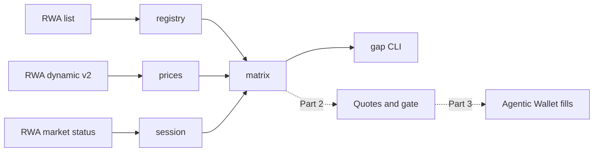

# Executable Gap Desk

**Displayed gaps lie. Executable ones don't.**

The same US stock trades on BNB Smart Chain as three different tokens: Ondo (`NVDAon`), xStocks (`NVDAx`) and bStocks (`NVDAB`). Their displayed prices can disagree by 10% or more, which looks like free money. Most of it isn't: the price is stale, the multiplier is wrong, or there is no liquidity to fill against.

Executable Gap Desk shows the displayed gap next to the executable one, gates every trade with a deterministic GO / CAUTION / BLOCK policy, and only then places small guarded fills through the Binance Agentic Wallet.

Built for **BNB Hack: Tokenized Stocks Edition** (BSC mainnet, spot only).

## Status

| Part | What | State |
|------|------|-------|
| 1 | Data truth: registry, session, per-share prices, displayed-gap matrix, CLI | done |
| 2 | Executable quotes and the GO / CAUTION / BLOCK gate | next |
| 3 | Guarded mainnet fills via `baw` with receipts | planned |
| 4 | Web desk | planned |
| 5 | Agentic Wallet and BNB Agent Studio integrations | planned |
| 6 | Ship: polish, demo, DX report | planned |

## Quickstart

Requires Node 24+ and pnpm 9.

```bash
pnpm i
pnpm gap matrix --multi          # every ticker listed on 2+ platforms, with displayed gaps and flags
pnpm gap matrix --ticker MSTR GME --sort gap
pnpm gap session                 # US session, countdown to the next open/close
pnpm gap resolve NVDA            # every BSC venue for a ticker, symbol or address
pnpm test                        # offline tests against recorded fixtures
```

No key is needed for the commands above. For the keyed Trading API (Part 2 onwards), copy `.env.example` to `.env.local`, fill in `BW3_API_KEY` and `BW3_API_SECRET`, and check them with:

```bash
pnpm gap ping
```

Example (2026-09-29, US regular session):

```text
MSTR   Ondo     MSTRon   $155.44   $155.77 ondo    -0.21%   TRADING
       bStocks  MSTRB    $155.47   $155.77 ondo    -0.19%   TRADING   no session
       xStocks  MSTRx    $138.86   $155.77 ondo   -10.86%   TRADING   LARGE GAP no session
```

MSTRx looks 11% cheap. Its price has not moved all day, and a $25 aggregator quote for it (like AAPLx and NVDAx) returns `40374 RWA_INSUFFICIENT_LIQUIDITY`. That is the trap this desk exists to catch.

## How it works



- **Registry** (`packages/core/src/registry.ts`): BSC venues from the public RWA list, platform by `type` (1 Ondo, 2 xStocks, 3 bStocks), grouped by ticker.
- **Session** (`session.ts`): market status normalized to premarket / regular / postmarket / overnight / closed / pause / weekend, with correctly ordered next open and close.
- **Prices** (`prices.ts`): `perShare = tokenPrice / sharesMultiplier`, using the live multiplier from dynamic v2. The reference is the underlying stock price (Ondo first, then xStocks), never a venue's own token price.
- **Matrix** (`matrix.ts`): displayed gap per venue with flags `LARGE_DISPLAYED_GAP` (3%+), `NO_PRICE`, `NO_REFERENCE`, `MULTIPLIER_MISMATCH`, `STATUS_MISSING` and `API_ERROR`. One failing venue never fails the matrix.
- **Signer** (`signer.ts`): HMAC-SHA256 request signing for the keyed Web3 API (`/build` prefix included in the signed path).

```text
packages/core/     data layer (config, http, schemas, registry, session, prices, matrix, signer) + tests
apps/agent/        gap CLI
scripts/           fixture recorder
docs/DX_LOG.md     developer-experience findings
docs/vendor/       snapshot of the Binance Web3 llms-full.txt docs
```

## Proof ledger

_Mainnet transactions, quotes and gate decisions will be listed here from Part 3._

| Time (UTC) | Venue | Side | Size | Gate | Quote vs fill | Tx |
|------------|-------|------|------|------|---------------|----|
| | | | | | | |

## Developer experience

We keep a running log of every rough edge we hit in the Binance Web3 APIs, the Skills Hub and the Agentic Wallet CLI, each with a reproduction and a suggested fix: [`docs/DX_LOG.md`](docs/DX_LOG.md) (15 entries so far).

_The full DX report will be summarized here in Part 6._

## License

[MIT](LICENSE)
